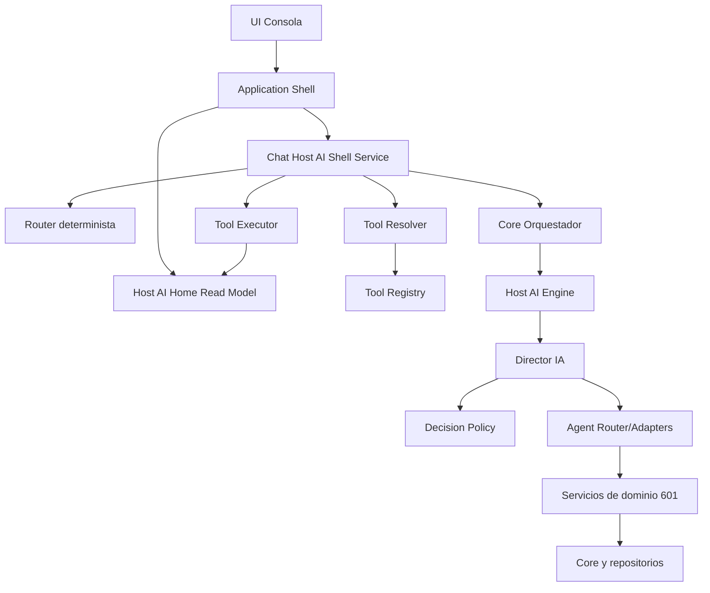

# HOST AI ARCHITECTURE REVIEW

Estado: Auditoria arquitectonica (solo lectura)
Fecha: 2026-07-24
Alcance: Host AI 6.0 antes de crecimiento (sin cambios funcionales)

## 1. Resumen ejecutivo

La arquitectura actual de Host AI 6.0 es solida para continuar evolucion hacia una plataforma multi-interfaz. El mayor acierto es la separacion progresiva entre conversacion, resolucion de intenciones y ejecucion por herramientas (Tool Framework), manteniendo restricciones de seguridad y sin acoplar la UI a proveedores de IA.

Fortalezas principales:

- Flujo de navegacion unificado chat -> navigation_request -> shell.
- Tool Executor con validaciones de tipo, estado y contexto.
- Session Context explicito y acotado a memoria.
- Engine desacoplado de proveedores reales por contrato.
- Director + Policy con trazabilidad y controles de confirmacion para escritura.

Riesgos principales:

- Duplicidad de mapeos (sidebar/modulo/contexto/tool) en varios modulos.
- Acoplamiento fuerte del chat a contratos internos del Tool Executor y payloads de herramientas.
- Coexistencia de dos modelos de contexto en capa APP/SERVICIOS.
- Brecha documental parcial entre especificacion historica de chat y estado real implementado por Tool Framework.

Conclusion: La base es apta para crecer sin tocar Core, pero conviene consolidar contratos unicos (navegacion, contexto, mapeos) antes de PLATFORM-02.

## 2. Mapa arquitectonico actualizado

Dependencias observadas por capa:

- UI -> Shell: [APP/app_shell_host_ai.py](APP/app_shell_host_ai.py#L57)
- Shell -> Chat Service: [APP/app_shell_host_ai.py](APP/app_shell_host_ai.py#L273)
- Shell ejecuta navegacion pendiente: [APP/app_shell_host_ai.py](APP/app_shell_host_ai.py#L431)
- Chat -> Router/Resolver/Registry/Executor: [SERVICIOS/chat_host_ai_shell_service.py](SERVICIOS/chat_host_ai_shell_service.py#L74)
- Chat -> Orquestador (consulta engine): [SERVICIOS/chat_host_ai_shell_service.py](SERVICIOS/chat_host_ai_shell_service.py#L410)
- Resolver -> mapa intent->tool: [SERVICIOS/host_ai_tool_resolver.py](SERVICIOS/host_ai_tool_resolver.py#L17)
- Registry -> catalogo oficial de tools: [SERVICIOS/host_ai_tool_registry.py](SERVICIOS/host_ai_tool_registry.py#L100)
- Executor -> validacion de tipos activos: [SERVICIOS/host_ai_tool_executor.py](SERVICIOS/host_ai_tool_executor.py#L65)
- Engine -> Director/Providers por contrato: [SERVICIOS/host_ai_engine/service.py](SERVICIOS/host_ai_engine/service.py#L10), [SERVICIOS/host_ai_engine/service.py](SERVICIOS/host_ai_engine/service.py#L22)
- Director -> Policy y plan secuencial: [SERVICIOS/host_ai_engine/director.py](SERVICIOS/host_ai_engine/director.py#L158), [SERVICIOS/host_ai_engine/director.py](SERVICIOS/host_ai_engine/director.py#L161)
- Policy -> prohibiciones y confirmaciones: [SERVICIOS/host_ai_engine/policy.py](SERVICIOS/host_ai_engine/policy.py#L14), [SERVICIOS/host_ai_engine/policy.py](SERVICIOS/host_ai_engine/policy.py#L33)

## 3. Dependencias (circulares, cruzadas, innecesarias, fuertes, ocultas)

### 3.1 Resultado global

- Dependencias circulares directas en los modulos auditados: no detectadas.
- Imports cruzados de riesgo entre capas criticas: bajos en UI/Tool Framework, medios en Chat/Engine por contratos internos.

### 3.2 Clasificacion por riesgo

1. ALTO - Duplicidad de mapeos de navegacion/contexto en varios puntos.
   Evidencia: [APP/app_shell_host_ai.py](APP/app_shell_host_ai.py#L88), [APP/app_shell_host_ai.py](APP/app_shell_host_ai.py#L103), [SERVICIOS/chat_host_ai_shell_service.py](SERVICIOS/chat_host_ai_shell_service.py#L89), [SERVICIOS/host_ai_tool_resolver.py](SERVICIOS/host_ai_tool_resolver.py#L26).
   Impacto: divergencias sutiles al agregar modulos o tools.

2. MEDIO - Dependencia oculta de Chat hacia estructura de respuesta de herramientas.
   Evidencia: [SERVICIOS/chat_host_ai_shell_service.py](SERVICIOS/chat_host_ai_shell_service.py#L261), [SERVICIOS/chat_host_ai_shell_service.py](SERVICIOS/chat_host_ai_shell_service.py#L285).
   Impacto: cambios en acciones/campos de ToolResult rompen UX de chat.

3. MEDIO - Dependencia de servicio de chat al contrato de orquestador Core por import local.
   Evidencia: [SERVICIOS/chat_host_ai_shell_service.py](SERVICIOS/chat_host_ai_shell_service.py#L410).
   Impacto: acoplamiento de capa de aplicacion a contrato de Core/orquestacion.

4. BAJO - Registry incluye metadata de servicio/operacion como strings no tipados.
   Evidencia: [SERVICIOS/host_ai_tool_registry.py](SERVICIOS/host_ai_tool_registry.py#L100).
   Impacto: menor seguridad de refactor; mitigable con validadores de consistencia.

5. CRITICO - No observado en los modulos auditados.

## 4. Acoplamiento

Analisis por componente pedido:

- Chat: acoplamiento MEDIO-ALTO. Conoce router, resolver, executor, session context y puente al engine; concentra transformaciones de salida.
  Referencia: [SERVICIOS/chat_host_ai_shell_service.py](SERVICIOS/chat_host_ai_shell_service.py#L74).

- Shell: acoplamiento MEDIO. Orquesta render, contexto UI, chat y apertura de menus legacy.
  Referencia: [APP/app_shell_host_ai.py](APP/app_shell_host_ai.py#L57).

- Router determinista: acoplamiento BAJO. Regla textual pura con salida IntentMatch.
  Referencia: [SERVICIOS/host_ai_deterministic_intent_router.py](SERVICIOS/host_ai_deterministic_intent_router.py#L32).

- Tool Executor: acoplamiento MEDIO. Poco acoplado a UI, pero acoplado a estructura de HomeReadService y handlers por convención `_tool_{id}`.
  Referencia: [SERVICIOS/host_ai_tool_executor.py](SERVICIOS/host_ai_tool_executor.py#L32).

- Director IA: acoplamiento MEDIO. Gran orquestador con tablas estaticas de operaciones, agentes, dependencias y niveles.
  Referencia: [SERVICIOS/host_ai_engine/director.py](SERVICIOS/host_ai_engine/director.py#L45).

- Contexto: acoplamiento MEDIO por coexistencia de dos servicios de contexto en capas cercanas.
  Referencia: [SERVICIOS/host_ai_session_context.py](SERVICIOS/host_ai_session_context.py#L25), [SERVICIOS/contexto_activo_host_ai.py](SERVICIOS/contexto_activo_host_ai.py#L28).

- Servicios de lectura Home: acoplamiento MEDIO con `core.*` y repos 601 (esperable en Application Service).
  Referencia: [SERVICIOS/host_ai_home_read_service.py](SERVICIOS/host_ai_home_read_service.py#L52).

## 5. Cohesion

Evaluacion de responsabilidad unica:

- Alta cohesion:
  - Router determinista.
  - Tool Resolver.
  - Tool Registry.
  - Session Context.

- Cohesion media:
  - HostAIHomeReadService (agregador multi-modulo, pero dentro de su rol).
  - HostAIEngine (gestion proveedor + logging + sanitizacion + modo director).

- Cohesion baja relativa:
  - ServicioChatHostAIShell: mezcla enrutado, composición UX, compatibilidad retro y normalizacion de acciones.
  - AppShellHostAI: mezcla render, control de flujo, sincronizacion de contexto y puente legacy.

## 6. Auditoria de Tool Registry

Estado general: robusto para PLATFORM-01.

Validaciones:

- Herramientas activas READ/NAVIGATION/ANALYSIS registradas.
- WRITE futuras registradas como deshabilitadas.
- Metadata completa por herramienta (categoria, tipo, permisos, contexto).

Hallazgos:

1. BAJO - Duplicidad semantica parcial en herramientas de eventos (`buscar_eventos`, `mostrar_eventos`, `mostrar_eventos_proximos`) que convergen en comportamientos muy similares.
2. MEDIO - El executor no valida formalmente que `operacion`/`servicio` metadata coincida con handler real; hoy confia en convencion de nombre.
3. BAJO - `permisos` definidos pero aun no aplicados como control efectivo en runtime para PLATFORM-01.

Referencias: [SERVICIOS/host_ai_tool_registry.py](SERVICIOS/host_ai_tool_registry.py#L100), [SERVICIOS/host_ai_tool_executor.py](SERVICIOS/host_ai_tool_executor.py#L32).

## 7. Contexto

Verificacion solicitada:

- Un unico modelo de contexto de sesion conversacional: SI (`HostAISessionContext`).
- Unica limpieza de sesion conversacional: SI (`reset` + comando `/clear`).
- Unica actualizacion por navegacion: SI (`actualizar_desde_navegacion`).

Riesgo detectado:

- MEDIO - Existen dos contextos a diferente nivel:
  - Contexto UI general (`ServicioContextoActivoHostAI`).
  - Contexto conversacional (`HostAISessionContext`).
  No es un bug actual, pero hay riesgo de desalineacion si crece sin contrato de sincronizacion unificado.

Referencias: [SERVICIOS/host_ai_session_context.py](SERVICIOS/host_ai_session_context.py#L55), [SERVICIOS/host_ai_session_context.py](SERVICIOS/host_ai_session_context.py#L89), [SERVICIOS/contexto_activo_host_ai.py](SERVICIOS/contexto_activo_host_ai.py#L28).

## 8. Navegacion

Verificacion:

- Unico flujo de navegacion desde chat: SI.
  Chat emite `navigation_request`; shell la procesa y abre modulo.

- Unico responsable final de apertura de modulo: SI (Shell).

- Ausencia de aperturas directas desde chat: SI en flujo principal auditado.

Referencias: [SERVICIOS/chat_host_ai_shell_service.py](SERVICIOS/chat_host_ai_shell_service.py#L160), [APP/app_shell_host_ai.py](APP/app_shell_host_ai.py#L431).

## 9. Engine

Verificacion solicitada: "Engine no conoce UI ni Core directamente; solo contratos".

Resultado: CUMPLE en los modulos auditados.

- El Engine depende de Director y Providers internos del paquete engine.
- No importa UI.
- No importa Core.

Referencias: [SERVICIOS/host_ai_engine/service.py](SERVICIOS/host_ai_engine/service.py#L10), [SERVICIOS/host_ai_engine/service.py](SERVICIOS/host_ai_engine/service.py#L22).

## 10. Director IA

Verificacion:

- No contiene logica de calculo culinario de bajo nivel: correcto.
- Si contiene logica de orquestacion avanzada (clasificacion, plan, dependencias, confirmaciones): correcto y esperado.
- Delega ejecucion a router/adapters/agentes: correcto.

Riesgo:

- MEDIO - El volumen de reglas/tablas en una sola clase aumenta complejidad de mantenimiento.

Referencias: [SERVICIOS/host_ai_engine/director.py](SERVICIOS/host_ai_engine/director.py#L45), [SERVICIOS/host_ai_engine/director.py](SERVICIOS/host_ai_engine/director.py#L161).

## 11. Policy

Estado: buena base para WRITE futura.

Fortalezas:

- Lista global de acciones prohibidas.
- Confirmacion obligatoria por operacion/nivel/persistencia.
- Bloqueo de capacidades no implementadas en modo ejecutar.

Puntos a preparar (sin implementar ahora):

- Matriz de permisos por rol/herramienta.
- Policy versionada por entorno (piloto/produccion).
- Evidencia de auditoria funcional cruzada con Tool Executor para WRITE.

Referencias: [SERVICIOS/host_ai_engine/policy.py](SERVICIOS/host_ai_engine/policy.py#L14), [SERVICIOS/host_ai_engine/policy.py](SERVICIOS/host_ai_engine/policy.py#L62).

## 12. Seguridad

Busqueda de bypass y accesos directos:

- UI -> Core directo: no detectado en flujo de chat oficial.
- Escritura fuera de Tool Executor en PLATFORM-01: no detectada para rutas activas de Tool Framework.
- Chat sin validar: mitigado por Router + Resolver + Executor.
- Tool no registrada o deshabilitada: bloqueada por Executor.

Riesgos residuales:

1. MEDIO - El motor Director/adapters tiene rutas de escritura reales por diseño para otros escenarios; requiere aislamiento estricto al habilitar WRITE en plataforma.
2. BAJO - No existe aun un "deny by default" por rol en Tool Executor (actualmente por tipo/estado/contexto).

Referencias: [SERVICIOS/host_ai_tool_executor.py](SERVICIOS/host_ai_tool_executor.py#L65), [SERVICIOS/host_ai_engine/adapters.py](SERVICIOS/host_ai_engine/adapters.py#L20).

## 13. Coherencia documental

Documentos revisados:

- [DOCUMENTACION/HOST_AI_CHAT_SPEC.md](DOCUMENTACION/HOST_AI_CHAT_SPEC.md)
- [DOCUMENTACION/HOST_AI_TOOL_REGISTRY.md](DOCUMENTACION/HOST_AI_TOOL_REGISTRY.md)
- [DOCUMENTACION/HOST_AI_ACTION_FRAMEWORK.md](DOCUMENTACION/HOST_AI_ACTION_FRAMEWORK.md)
- [DOCUMENTACION/HOST_AI_SESSION_CONTEXT.md](DOCUMENTACION/HOST_AI_SESSION_CONTEXT.md)
- [DOCUMENTACION/HOST_AI_APP_SHELL.md](DOCUMENTACION/HOST_AI_APP_SHELL.md)
- [DOCUMENTACION/HOST_AI_UX_VISION.md](DOCUMENTACION/HOST_AI_UX_VISION.md)

Resultado:

- Coherencia general: ALTA.
- Contradiccion mayor: no detectada.
- Desalineacion menor detectada: `HOST_AI_CHAT_SPEC` mantiene parte de redaccion de "integracion prevista" historica mientras Tool Framework ya esta implementado en runtime.

Accion en este sprint:

- No se actualizan esos documentos para respetar alcance de auditoria sin cambios funcionales.
- Se deja trazado en este informe como deuda documental media-baja.

## 14. Preparacion para Web/Escritorio/Movil/API

Evaluacion:

- Web: SI, viable con adaptador de presentacion nuevo (React/Vue/HTML) reutilizando Chat Service + Tool Framework + Engine.
- Escritorio: SI, ya existe base consola y puede migrar a wrapper GUI sin tocar Core.
- Movil: SI, si se expone capa API intermedia y se evita portar logica de shell a cliente.
- API: SI, recomendada como paso previo a web/movil para desacoplar interfaz.

Condicion clave:

- Mantener contratos estables de `navigation_request`, `tool_result` y `session_context`.

Veredicto: arquitectura preparada para multi-canal sin modificar Core, con trabajo de adaptacion en capa de presentacion y API.

## 15. Preparacion para IA real (OpenAI)

### Imprescindible

1. Configuracion segura de secretos y rotacion.
2. Adaptador de proveedor real en Engine con fallback a SIMULADO.
3. Limites de costo/latencia/reintentos/timeouts.
4. Sanitizacion reforzada de logs y payloads de prompts/respuestas.
5. Suite de regresion contractual (consultar/proponer/ejecutar con confirmacion).

### Recomendable

1. Capa de "prompt policy" separada por intencion.
2. Evaluacion automatica de calidad de respuestas.
3. Cache de consultas idempotentes de lectura.
4. Circuit breaker por proveedor.

### Opcional

1. Multi-proveedor activo por estrategia.
2. Enrutado adaptativo por costo/rendimiento.
3. Trazas enriquecidas para analitica de prompts.

## 16. Deuda tecnica clasificada

### Critica

- No detectada en alcance auditado.

### Alta

1. Consolidar mapeos duplicados de modulo/sidebar/contexto/tool en un contrato unico.
   Impacto: alto en mantenibilidad, medio en riesgo de regresiones.

### Media

1. Reducir complejidad de ServicioChatHostAIShell separando ensamblado de respuestas y adaptacion UX.
2. Extraer tablas de Director IA a configuracion versionada para reducir gigantismo de clase.
3. Alinear `HOST_AI_CHAT_SPEC` al estado realmente implementado por Tool Framework.

### Baja

1. Validacion formal de coherencia metadata tool <-> handler executor.
2. Aplicar permisos efectivos en runtime por herramienta (ademas de tipo/estado).

## 17. Calidad por componente (0 a 10)

- Core: 8.8
  Justificacion: estable, desacoplado del sprint, con orquestacion madura.

- Servicios: 8.2
  Justificacion: buena modularidad, algun acoplamiento por strings y contratos de facto.

- Shell: 7.6
  Justificacion: cumple su rol, pero mezcla render + control + compatibilidad legacy.

- Chat: 7.4
  Justificacion: potente y funcional, con sobrecarga de responsabilidades.

- Contexto: 7.9
  Justificacion: modelo conversacional claro; dualidad con contexto UI genera riesgo de deriva.

- Tool Registry: 8.5
  Justificacion: catalogo claro y extensible, WRITE futuras bien aisladas.

- Engine: 8.6
  Justificacion: buena separacion por contratos y soporte multi-provider preparado.

- Director IA: 8.0
  Justificacion: orquestacion robusta, pero clase extensa con mucha regla embebida.

- Observabilidad: 8.1
  Justificacion: logs estructurados en chat/tools/engine, pendiente consolidacion de dashboards.

- Documentacion: 7.7
  Justificacion: buena cobertura, con desalineaciones menores de timing entre spec e implementacion.

- Seguridad: 8.3
  Justificacion: buenas barreras actuales; pendiente RBAC por tool y hardening para IA real.

- Escalabilidad: 7.8
  Justificacion: base reusable multi-canal, necesita API facade y contratos mas estrictos.

- Mantenibilidad: 7.5
  Justificacion: deuda por duplicidad de mapeos y responsabilidades concentradas.

- Testabilidad: 8.4
  Justificacion: suites relevantes ya existentes y flujo determinista facil de probar.

## 18. Fortalezas

1. Enrutado oficial por herramientas con ejecucion validada.
2. Navegacion centralizada en shell sin aperturas directas desde chat.
3. Session context operativo, acotado y sin persistencia.
4. Engine preparado para multi-proveedor sin acoplar UI.
5. Director + Policy con enfoque seguro para escrituras futuras.

## 19. Riesgos prioritarios

1. ALTO - Divergencia de mapeos duplicados (sidebar/modulo/contexto/tool).
2. MEDIO - Crecimiento de complejidad en chat (acoplamiento funcional/UX).
3. MEDIO - Complejidad estructural del director por reglas embebidas.
4. MEDIO - Posible deriva entre contexto UI y contexto conversacional si no se unifica contrato.
5. BAJO - Metadata de tools sin validacion de consistencia automatica.

## 20. Decisiones recomendadas (justificadas)

1. Crear un contrato unico de navegacion/contexto/mapeo consumido por Shell, Chat y Resolver.
2. Extraer serializacion de respuestas de chat a un adapter dedicado.
3. Externalizar tablas de operaciones/dependencias del Director a archivo de configuracion validado.
4. Introducir validadores automaticos de registry/executor.
5. Definir capa API de aplicacion antes de interfaz web/movil.

## 21. Roadmap recomendado (proximos 5 sprints)

1. SPRINT ARQ-01 - Unificacion de contratos de navegacion/contexto
   Objetivo: eliminar mapeos duplicados y reducir riesgo de divergencia.

2. SPRINT ARQ-02 - Refactor de Chat Adapter
   Objetivo: separar orquestacion de intenciones de composicion UX y compatibilidad.

3. SPRINT ARQ-03 - Configuracion declarativa de Director
   Objetivo: mover tablas de operaciones/dependencias/niveles a configuracion validable.

4. SPRINT ARQ-04 - API Facade para multi-canal
   Objetivo: exponer contratos estables para web/escritorio/movil sin tocar Core.

5. SPRINT ARQ-05 - Preparacion IA real (hardening)
   Objetivo: seguridad de secretos, fallback, limites, auditoria y suite contractual para primer proveedor real.

## 22. Confirmaciones de alcance (criterios de aceptacion)

- No se modifico funcionalidad existente.
- No se modifico Core.
- No se cambiaron reglas de negocio.
- No se conectaron proveedores IA reales.
- No se escribieron datos de negocio.
- No se inicio PLATFORM-02 automaticamente.

## 23. Evidencia de archivos revisados (principal)

- [APP/app_shell_host_ai.py](APP/app_shell_host_ai.py)
- [SERVICIOS/chat_host_ai_shell_service.py](SERVICIOS/chat_host_ai_shell_service.py)
- [SERVICIOS/host_ai_deterministic_intent_router.py](SERVICIOS/host_ai_deterministic_intent_router.py)
- [SERVICIOS/host_ai_tool_registry.py](SERVICIOS/host_ai_tool_registry.py)
- [SERVICIOS/host_ai_tool_resolver.py](SERVICIOS/host_ai_tool_resolver.py)
- [SERVICIOS/host_ai_tool_executor.py](SERVICIOS/host_ai_tool_executor.py)
- [SERVICIOS/host_ai_session_context.py](SERVICIOS/host_ai_session_context.py)
- [SERVICIOS/host_ai_home_read_service.py](SERVICIOS/host_ai_home_read_service.py)
- [SERVICIOS/host_ai_engine/service.py](SERVICIOS/host_ai_engine/service.py)
- [SERVICIOS/host_ai_engine/director.py](SERVICIOS/host_ai_engine/director.py)
- [SERVICIOS/host_ai_engine/policy.py](SERVICIOS/host_ai_engine/policy.py)
- [SERVICIOS/host_ai_engine/adapters.py](SERVICIOS/host_ai_engine/adapters.py)
- [SERVICIOS/host_ai_engine/agent_registry.py](SERVICIOS/host_ai_engine/agent_registry.py)
- [CORE/orquestador.py](CORE/orquestador.py)