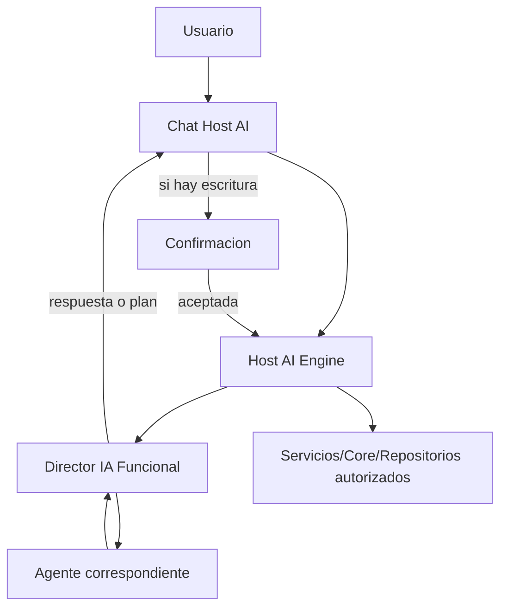

# HOST AI CHAT SPEC

Estado: Borrador de arquitectura (sprint de diseno)
Version: 1.0
Fecha: 2026-07-23
Ambito: Arquitectura, integracion y contratos del Chat Host AI

## 1. Proposito

Definir el modulo CHAT HOST AI como puerta conversacional de Host AI dentro de la ruta oficial de arranque, reutilizando Core, Host AI Engine, Director IA, Policy y Agentes existentes, sin cambiar reglas de negocio ni conectar IA real.

## 2. Restricciones del sprint

- No conectar OpenAI ni otros proveedores reales.
- No modificar reglas del Core.
- No crear logica de negocio nueva.
- No sustituir ni eliminar menus existentes.
- No crear persistencias nuevas de conversaciones largas.
- Mantener confirmaciones y auditoria en las rutas con escritura.

## 3. Objetivo funcional del modulo

CHAT HOST AI sera la entrada conversacional comun para:

- Consultar estado operativo.
- Proponer planes de accion.
- Ejecutar solo tras confirmacion.
- Reutilizar exactamente los contratos del Engine/Director.

## 4. Arquitectura objetivo



## 5. Reutilizacion de componentes existentes

El Chat Host AI se apoya en componentes ya presentes:

- Core y orquestador: encaminamiento de solicitudes y respuesta estructurada.
- Host AI Engine: creacion de solicitudes, proveedores, auditoria, sanitizacion.
- Director IA Funcional: clasificacion, planificacion, dependencias y confirmaciones.
- Policy: bloqueo de acciones prohibidas y confirmacion obligatoria.
- Agent Registry: contratos de capacidades por agente.

No se permite bypass directo del chat a repositorios.

## 6. Integracion prevista en Modo Piloto Privado

### 6.1 Ubicacion funcional

Dentro de Modo Piloto Privado se define una opcion visible adicional:

- "Chat Host AI"

Esta opcion convivira con todas las opciones actuales del menu y no sustituira ninguna.

### 6.2 Comportamiento esperado

- Abre una sesion conversacional de alto nivel.
- Muestra contexto activo detectado.
- Permite CONSULTAR, PROPONER y EJECUTAR (con confirmacion).
- Presenta respuesta estructurada y trazable.

## 7. Contratos de entrada y salida

## 7.1 Contrato de entrada del chat (normalizado)

```json
{
  "usuario": "string",
  "origen": "MODO_PILOTO_PRIVADO",
  "modulo_origen": "chat_host_ai",
  "texto_original": "string",
  "intencion": "string",
  "nivel_de_autonomia": "CONSULTAR|PROPONER|EJECUTAR",
  "datos_de_entrada": {},
  "contexto": {
    "evento_id": "string|null",
    "receta_id": "string|null",
    "escandallo_id": "string|null",
    "menu_id": "string|null",
    "plan_produccion_id": "string|null",
    "usuario_id": "string|null",
    "estado_operativo": "string|null"
  },
  "proveedor_preferido": "SIMULADO",
  "formato_entrada": "texto",
  "confirmaciones_recibidas": [],
  "version_del_contrato": "1.0"
}
```

Notas:

- `proveedor_preferido` queda en `SIMULADO` durante este sprint.
- `intencion` en esta fase puede venir de reglas simples de intencion registrada (no NLP real).

## 7.2 Contrato de salida del chat (envoltorio conversacional)

```json
{
  "ok": true,
  "estado": "COMPLETADA|COMPLETADA_CON_INCIDENCIAS|ESPERANDO_CONFIRMACION|CANCELADA|BLOQUEADA|ERROR",
  "tipo_mensaje": "CONSULTA|PROPUESTA|ADVERTENCIA|INCIDENCIA|CONFIRMACION|ERROR|EXPLICACION|AYUDA",
  "mensaje_usuario": "string",
  "resultado": {},
  "plan": {},
  "incidencias": [],
  "confirmaciones_requeridas": [],
  "acciones_recomendadas": [],
  "contexto_actualizado": {}
}
```

## 8. Tipos de mensaje del Chat Host AI

Se define el catalogo funcional:

- CONSULTA: respuesta informativa sin escritura.
- PROPUESTA: plan sugerido sin ejecutar escritura.
- ADVERTENCIA: riesgo o dato incompleto sin bloqueo total.
- INCIDENCIA: bloqueo funcional por falta/ambiguedad/conflicto.
- CONFIRMACION: solicitud explicita para permitir persistencia.
- ERROR: fallo tecnico o excepcion controlada.
- EXPLICACION: descripcion de por que se sugiere un plan.
- AYUDA: guia de uso y ejemplos de comandos.

## 9. Contexto activo del chat

## 9.1 Fuentes de contexto

El chat debe poder operar con contexto activo de:

- evento actual
- receta actual
- escandallo actual
- menu actual
- produccion actual
- usuario
- estado operativo

## 9.2 Politica de contexto

- El contexto se adjunta por sesion, no se persiste como historial largo.
- El contexto contextual (pantalla actual) tiene prioridad sobre contexto general.
- Si hay ambiguedad, el chat debe pedir precision antes de planificar escritura.

## 10. Historial y memoria conversacional (fase arquitectura)

Se define almacenamiento temporal en memoria de proceso:

```json
{
  "session_id": "string",
  "mensajes": [],
  "planes_generados": [],
  "confirmaciones": [],
  "contexto_activo": {}
}
```

Reglas de este sprint:

- Sin persistencia nueva en disco para historial largo.
- Mantener solo ventana corta de sesion (por ejemplo, N mensajes recientes).
- Conservar trazabilidad de ejecucion en los logs ya existentes del Engine/Director.

## 11. Comandos naturales (registro de intencion)

En este sprint no hay comprension IA avanzada. Solo mapeo de intenciones registradas.

Ejemplos de comandos soportados conceptualmente:

- buscar receta
- abrir escandallo
- mostrar menu
- importar Word
- importar Excel
- crear receta
- duplicar menu
- recalcular costes
- abrir produccion
- que falta comprar
- que incidencias tengo

Contrato de salida de clasificacion de intencion (sin NLP real):

```json
{
  "texto": "string",
  "intencion_canonica": "string",
  "nivel_autonomia_sugerido": "CONSULTAR|PROPONER|EJECUTAR",
  "objetivos": [],
  "modulo_objetivo": "string",
  "confianza": "baja|media|alta",
  "requiere_aclaracion": true
}
```

## 12. Confirmaciones y seguridad

Toda accion con impacto en datos debe seguir este circuito:

1. Plan del Director IA.
2. Evaluacion de Policy.
3. Solicitud de confirmacion explicita.
4. Ejecucion por servicios autorizados.
5. Auditoria de decision y resultado.

Reglas no negociables:

- Sin bypass a repositorios.
- Sin escritura directa desde UI chat.
- Sin ejecutar operaciones globalmente prohibidas.

## 13. Chat contextual reutilizable

El mismo Chat Host AI se reutiliza en modo contextual:

- En receta: "Explicame esta receta".
- En menu: "Analiza este menu".
- En produccion: "Que problema tiene esta tarea".

Mecanismo:

- La UI que invoca el chat adjunta `contexto` con IDs activos.
- El Director/Agente utiliza ese contexto sin crear flujos paralelos nuevos.

## 14. Matriz de proveedores (preparacion)

Compatibilidad objetivo del chat a traves de Host AI Engine:

- SIMULADO: activo en este sprint.
- OPENAI: preparado, no conectado.
- AZURE_OPENAI: preparado, no conectado.
- CLAUDE: preparado, no conectado.
- GEMINI: preparado, no conectado.
- LOCAL: preparado, no conectado.

Principio de desacople:

- El chat no depende del proveedor concreto.
- Solo define `proveedor_preferido` y contrato de solicitud.
- El Engine resuelve el proveedor efectivo.

## 15. Ejemplos de flujo

## 15.1 Consulta

Entrada: "Que compras tengo abiertas"

- Chat registra intencion `consultar_necesidades`.
- Director delega en COMPRAS_IA (consulta).
- Respuesta tipo CONSULTA sin confirmacion.

## 15.2 Propuesta

Entrada: "Importa este Word"

- Chat registra intencion de importacion.
- Director genera plan con IMPORTACION_IA/CATALOGO_IA/RECETAS_IA.
- Respuesta tipo PROPUESTA con incidencias si faltan datos.

## 15.3 Ejecucion con confirmacion

Entrada: "Crea el menu"

- Chat registra intencion `crear_menu`.
- Director planifica pasos y detecta persistencia.
- Policy exige confirmacion.
- El chat emite tipo CONFIRMACION.
- Solo tras respuesta aceptada se ejecuta.

## 16. Dependencias del modulo Chat Host AI

Dependencias funcionales:

- Orquestador Host AI.
- Host AI Engine.
- Director IA Funcional.
- Host AI Decision Policy.
- Agent Registry.
- Servicios de dominio ya certificados (eventos, recetas, escandallos, menus, compras, stock, produccion).

Dependencias de UI:

- Entrada de menu en Modo Piloto Privado.
- Render de mensajes por tipo.
- Captura de confirmaciones.

## 17. Integracion prevista (sin implementar en este sprint)

1. Crear punto de entrada UI `ChatHostAIPanel` en capa APP.
2. Anadir opcion visible en Modo Piloto Privado sin eliminar opciones existentes.
3. Encaminar toda conversacion al contrato de `host_ai_engine_consulta` con `usar_director=true`.
4. Mantener `proveedor_preferido=SIMULADO` por defecto.
5. Exponer contexto activo desde cada pantalla que invoque chat contextual.
6. Mostrar confirmaciones pendientes y recoger respuesta del usuario.

## 18. Pasos para conectar el primer proveedor IA (futuro controlado)

Precondiciones:

- Politica de secretos definida.
- Variable de entorno del proveedor en entorno seguro.
- Suite minima de regresion del chat y de confirmaciones en verde.
- Validacion de sanitizacion de logs.

Pasos:

1. Implementar proveedor real en capa `providers` del Engine sin tocar contratos del chat.
2. Mantener fallback a `SIMULADO` ante errores de conectividad.
3. Habilitar el proveedor por configuracion, no por hardcode en UI.
4. Ejecutar pruebas de no regresion en CONSULTAR/PROPONER/EJECUTAR con confirmacion.
5. Registrar certificacion especifica del proveedor conectado y su alcance.

## 19. Fuera de alcance de este sprint

- Conexion real con OpenAI/Azure/Claude/Gemini/local.
- Implementacion NLP avanzada o clasificacion probabilistica completa.
- Nuevos calculos de negocio.
- Nueva persistencia de historiales largos.
- Sustitucion de menus actuales.

## 20. Criterios de aceptacion del documento

- Arquitectura definida end-to-end del Chat Host AI.
- Contratos de entrada/salida/contexto/historial/confirmacion definidos.
- Integracion prevista en Modo Piloto Privado documentada.
- Compatibilidad con proveedores documentada sin conexion real.
- Restricciones de seguridad y no bypass explicitadas.

## 21. Actualizacion APP-01.5 (determinista)

- Se incorpora un router determinista de intenciones limitadas previo al enrutado funcional.
- El proveedor activo sigue siendo exclusivamente `SIMULADO`.
- Las consultas de estado se apoyan en un modelo de lectura unificado (`HostAIHomeReadService`).
- Se habilitan acciones seguras de navegacion desde resultados (sin escrituras).
- Se mantiene memoria de sesion limitada sin persistencia de conversaciones largas.
